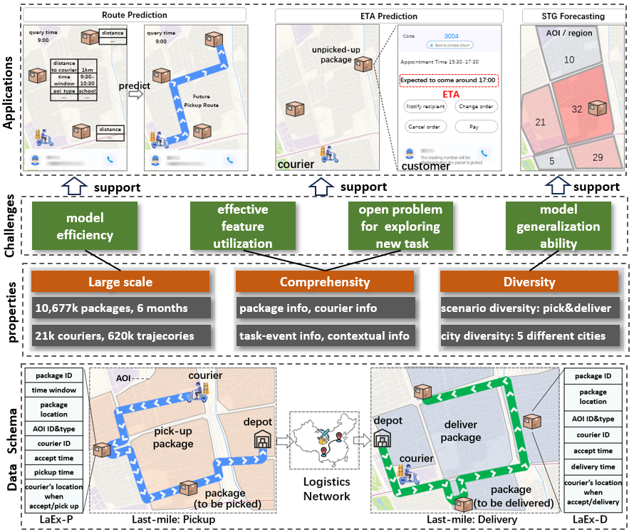

# 1 About Dataset
**LaEx** is a  publicly available last-mile delivery dataset with  millions of packages from industry. 
It has three unique characteristics:  (1) Large-scale. It involves 10,677k packages of 21k couriers over 6 months of real-world operation. 
(2) Comprehensive information, it offers original package information, such as its location and time requirements, as well as task-event information, which records when and where the courier is while events such as task-accept and task-finish events happen. 
(3) Diversity: the dataset includes data from various scenarios, such as package pick-up and delivery, and from multiple cities, each with its unique spatio-temporal patterns due to their distinct characteristics such as populations.


# 2 Download
LaEx is composed of two subdatasets: i) [LaEx-D](https://huggingface.co/datasets/Anonymous-LaEx/Anonymous/tree/main/delivery), which comes from the package delivery scenario.
ii) [LaEx-P](https://huggingface.co/datasets/Anonymous-LaEx/Anonymous/tree/main/pickup), which comes from the package pickup scenario. To facilitate the utilization of the dataset, each sub-dataset is presented in CSV format.

LaEx can be used for research purposes. Before you download the dataset, please read these terms. And [Code link](https://anonymous.4open.science/r/Anonymous-64B3/). Then put the data into "./data/raw/".  
The structure of "./data/raw/" should be like:  
```
* ./data/raw/  
    * delivery    
        * delivery_sh.csv   
        * ...    
    * pickup  
        * pickup_sh.csv  
        * ...  
```

Each sub-dataset contains 5 csv files, with each representing the data from a specific city,  the detail of each city can be find in the following table.


|   City     |  Description                                                                                  |
|------------|----------------------------------------------------------------------------------------------|
| Shanghai   | One of the most prosperous cities in China, with a large number of orders per day.           |
| Hangzhou   | A big city with well-developed online e-commerce and a large number of orders per day.        |
| Chongqing  | A big city with complicated road conditions in China, with a large number of orders.          |
| Jilin      | A middle-size city in China, with a small number of orders each day.                          |
| Yantai     | A small city in China, with a small number of orders every day.                               |


# 3 Description
Below is the detailed field of each sub-dataset.
## 3.1 LaEx-P
| Data field                 | Description                                  | Unit/format  |
|----------------------------|----------------------------------------------|--------------|
| **Package information**    |                                              |              |
| package_id                 | Unique identifier of each package             | Id           |
| time_window_start          | Start of the required time window             | Time         |
| time_window_end            | End of the required time window               | Time         |
| **Stop information**       |                                              |              |
| lng/lat                    | Coordinates of each stop                      | Float        |
| city                       | City                                         | String       |
| region_id                  | Id of the Region                              | String       |
| aoi_id                     | Id of the AOI (Area of Interest)              | Id           |
| aoi_type                   | Type of the AOI                               | Categorical  |
| **Courier Information**    |                                              |              |
| courier_id                 | Id of the courier                             | Id           |
| **Task-event Information** |                                              |              |
| accept_time                | The time when the courier accepts the task    | Time         |
| accept_gps_time            | The time of the GPS point closest to accept time | Time       |
| accept_gps_lng/lat         | Coordinates when the courier accepts the task | Float        |
| pickup_time                | The time when the courier picks up the task   | Time         |
| pickup_gps_time            | The time of the GPS point closest to pickup_time | Time       |
| pickup_gps_lng/lat         | Coordinates when the courier picks up the task | Float        |
| **Context information**    |                                              |              |
| ds                         | The date of the package pickup                | Date         |


## 3.2 LaEx-D
| Data field            | Description                          | Unit/format   |
|-----------------------|--------------------------------------|---------------|
| **Package information**   |                                      |               |
| package_id            | Unique identifier of each package     | Id            |
| **Stop information**      |                                      |               |
| lng/lat               | Coordinates of each stop              | Float         |
| city                  | City                                 | String        |
| region_id             | Id of the region                      | Id            |
| aoi_id                | Id of the AOI                         | Id            |
| aoi_type              | Type of the AOI                       | Categorical   |
| **Courier Information**   |                                      |               |
| courier_id            | Id of the courier                     | Id            |
| **Task-event Information**|                                      |               |
| accept_time           | The time when the courier accepts the task | Time      |
| accept_gps_time       | The time of the GPS point whose time is the closest to accept time | Time |
| accept_gps_lng/accept_gps_lat | Coordinates when the courier accepts the task | Float |
| delivery_time         | The time when the courier finishes delivering the task | Time |
| delivery_gps_time     | The time of the GPS point whose time is the closest to the delivery time | Time |
| delivery_gps_lng/delivery_gps_lat | Coordinates when the courier finishes the task | Float |
| **Context information**  |                                      |               |
| ds                    | The date of the package delivery      | Date          |


# 4 Leaderboard
Blow shows the performance of different methods in Shanghai.
## 4.1 Route Prediction

Experimental results of route prediction. We use bold and underlined fonts to denote the best and runner-up model, respectively.

| Method       | HR@3         | KRC          | LSD         | ED          |
|--------------|--------------|--------------|-------------|-------------|
| TimeGreedy   | 57.65        | 31.81        | 5.54        | 2.15        |
| DistanceGreedy | 60.77        | 39.81        | 5.54        | 2.15        |
| OR-Tools     | 66.21        | 47.60        | 4.40        | 1.81        |
| LightGBM     | 73.76        | 55.71        | 3.01        | 1.84        |
| FDNET        | 73.27 ± 0.47 | 53.80 ± 0.58 | 3.30 ± 0.04 | 1.84 ± 0.01 |
| DeepRoute    | 74.68 ± 0.07 | 56.60 ± 0.16 | 2.98 ± 0.01 | 1.79 ± 0.01 |
| Graph2Route  | 74.84 ± 0.15 | 56.99 ± 0.52 | 2.86 ± 0.02 | 1.77 ± 0.01 |


## 4.2 Estimated Time of Arrival Prediction

| Method | MAE          | RMSE         | ACC@30      |
| ------ |--------------|--------------|-------------|
| LightGBM | 17.48        | 20.39        | 0.85        |
| SPEED | 23.75        | 27.86        | 0.73        |
| KNN | 21.28        | 25.36        | 0.75        |
| MLP | 21.54 ± 2.20 | 25.05 ± 2.46 | 0.79 ± 0.04 |
| FDNET | 18.47 ± 0.25 | 21.44 ± 0.28 | 0.84 ± 0.01 |


## 4.3 Spatio-temporal Graph Forecasting


| Method | MAE         | RMSE        |
|-------|-------------|-------------|
| HA    | 4.63        | 9.91        |
| DCRNN | 3.69 ± 0.09 | 7.08 ± 0.12 |
| STGCN | 3.04 ± 0.02 | 6.42 ± 0.05 |
| GWNET | 3.16 ± 0.06 | 6.56 ± 0.11 |
| ASTGCN | 3.12 ± 0.06 | 6.48 ± 0.14 |
| MTGNN | 3.13 ± 0.04 | 6.51 ± 0.13 |
| AGCRN  | 3.93 ± 0.03 | 7.99 ± 0.08 |
| STGNCDE  | 3.74 ± 0.15 | 7.27 ± 0.16 |